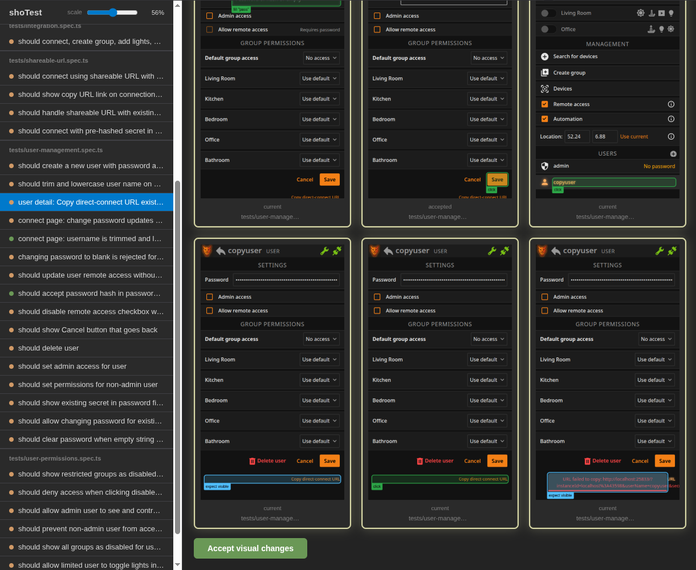

# ShoTest

ShoTest is a small wrapper around Playwright Test that acts as a drop-in replacement and provides:

- Automatic screenshots at every step of your test, overlaid with markers showing actions taken or elements verified.
- A local web app for browsing test results, comparing changes against the stored baseline, and accepting intentional changes.
- HTML snapshots at every step, for debugging (by coding agents).
- Helpers for recording demo videos with visible interactions and natural delays.



## Setup

Install `shotest` (*instead* of installing `@playwright/test` directly) and install a browser:

```bash
npm install -D shotest
npx shotest install chromium
```

Create a `tests/` directory, in which your tests will live as `.spec.ts` files.

Add the `test-results` directory to `.gitignore`.

Create a `playwright.config.ts`, that may look something like this:

```ts
import { defineConfig, devices } from 'shotest';

export default defineConfig({
  use: {
    baseURL: 'https://automationexercise.com/', // set to your app URL
    screenshot: 'off', // ShoTest captures its own screenshots
    viewport: { width: 450, height: 800 },
  },
  timeout: 5000, // ms before a test fails
  workers: 1, // set this if your app has state
  webServer: [ // start your test-servers here (optional)
    // { 
    //   command: 'exec npm run dev -- --port 25833',
    //   port: 25833,
    // },
  ]
});
```

If you use Claude Code, GitHub Copilot or another AI agent that supports Skills, ShoTest includes a `skill/` directory in its npm package that provides the docs such that it can be easily loaded as a skill for in-context guidance while writing tests. To set this up:

```bash
mkdir -p .claude/skills
ln -s ../../node_modules/shotest/skill .claude/skills/shotest
```

## Basic usage

ShoTest re-exports the full Playwright Test API, which you can use like normal. For example:

```ts
// tests/example.spec.ts
import { test } from 'shotest';

test('view and buy a product', async ({ page }) => {
    await page.goto('/');

    await page
        .locator('.product-image-wrapper', { hasText: 'Fancy Green Top' })
        .getByRole('link', { name: 'View Product' })
        .click();

    await page.getByRole('heading', { name: 'Fancy Green Top' }).waitFor();
    await page.getByRole('button', { name: /add to cart/i }).click();
    await page.getByRole('link', { name: /view cart/i }).click();
});
```

Most common page and locator actions are wrapped so that a screenshot is taken automatically during the test.

Run the tests using:

```sh
npx shotest test
```

This should output screenshots and HTML snapshots for each step to the default Playwright per-test output directory under `test-results/`.

The `shotest` command forwards arguments to Playwright, so `npx shotest test --ui` maps to `playwright test --ui`.

When the `--fail-on-visual-changes` flag is passed, ShoTest exits with a non-zero code if any visual changes compared to the accepted baseline in `test-accepted/` (or `$SHOTEST_ACCEPTED_DIR`) are detected, even if the test assertions pass. This allows you to enforce visual consistency in your CI pipeline.

ShoTest compares screenshots with `odiff-bin` and relies on it to decide whether a visual change is significant.

## Reviewing and accepting visual changes

In order to review test results, compare changes against the baseline, and accept intentional changes, run the ShoTest review server:

```bash
npx shotest review
```

It serves a web app on localhost and attempts to open it in your default browser.

When you press the 'Accept visuals' button for a test, its output screenshots are copied to the `test-accepted` directory (configurable through `SHOTEST_ACCEPTED_DIR`), and become the new accepted baseline. It is recommended to commit changes to this directory to version control (unlike `test-results/`).

## Multi-user tests

ShoTest can label screenshots per browser page, which makes multi-user interaction tests practical to script and review.

The recommended API is `splitIntoRoles(page, ...)`. It repurposes the current `page` for the first requested role, then creates additional labeled browser sessions for the later roles and opens them on the same URL as the original page.

```ts
import { test, expect, splitIntoRoles } from 'shotest';

test('buyer sees seller status update', async ({ page }) => {
  await page.goto('/orders');

  const { seller, buyer } = await splitIntoRoles(page, 'seller', 'buyer');

  await seller.getByRole('button', { name: 'Mark as shipped' }).click();
  await buyer.getByText('Shipped').waitFor();

  await expect(buyer.getByText('Shipped')).toBeVisible();
});
```

Notes:

- Call `splitIntoRoles(page, ...)` before the first interaction you want attributed to those roles. The first named role reuses the current page.
- Later roles start on the same URL as the original page, but in their own browser sessions.
- Repeating a role name within a test returns the same page instead of creating a duplicate session.
- Labeled pages prefix screenshot filenames automatically, so named screenshots like `screenshot(page, 'dashboard')` do not collide across users.
- Extra pages created by `splitIntoRoles()` are closed automatically at the end of the test.

## Recording demo videos

ShoTest includes a couple of helper functions (named `demo`Something) that are not part of Playwright, for recording demonstration videos with visible interactions and natural delays. 
 
```ts
import { test, expect, demoTap, demoType, demoPause, demoSwipe } from 'shotest';

test('demo', async ({ page }) => {
  await page.goto('http://localhost:3000');
  await demoTap(page, page.getByRole('button', { name: 'Open settings' }));
  await demoType(page, page.getByLabel('Name'), 'Living room');
  await demoPause(page, 1200);
});
```

**Important:** These helpers behave differently, depending on whether *demo mode* is active:

- Demo mode active. The helper functions will emulate real user interactions with small delays, and add touch effects to taps and swipes. No overlaid screenshots are captured, so as not to disturb the video.
- Demo mode inactive. The helper functions run as fast as possible with no delays or visual effects. This allows you to include your demo recording script in your test suite, without an outsized impact on test runtime.

Demo mode is automatically activated when Playwright video recording is enabled or when it's running in headed mode. You can override this by setting the `SHOTEST_DEMO` environment variable to `on` or `off`.

A convenient way to record demo videos for a run is to set `SHOTEST_VIDEO` to `on` when invoking ShoTest:

```sh
SHOTEST_VIDEO=on npx shotest test
```

This uses Playwright's normal video output handling (which you can also enable through its `defineConfig`), so the videos are written to the standard per-test output directory under `test-results/`. 

### Demo function reference

The following is auto-generated from `src/video.ts`:

### demoTap · function

Tap an element with a visible touch ripple effect.

In video mode, shows an expanding ripple animation at the tap point and
waits briefly after clicking for a natural feel. When not in video mode,
performs an instant click with no delay.

**Signature:** `(page: Page, locator: Locator, delayMs?: number) => Promise<void>`

**Parameters:**

- `page: Page` - - The Playwright page instance.
- `locator: Locator` - - The element to tap.
- `delayMs: number` (optional) - - Post-tap delay in video mode (default: 800ms). Ignored outside video mode.

### demoType · function

Type text character-by-character with natural timing.

In video mode, clicks the element and types each character with a delay,
simulating realistic human typing. When not in video mode, fills the input
instantly using `locator.fill()`.

**Signature:** `(page: Page, locator: Locator, text: string, charDelayMs?: number) => Promise<void>`

**Parameters:**

- `page: Page` - - The Playwright page instance.
- `locator: Locator` - - The input element to type into.
- `text: string` - - The text to type.
- `charDelayMs: number` (optional) - - Delay between characters in video mode (default: 80ms). Ignored outside video mode.

### demoPause · function

Pause for a specified duration (video mode only).

In video mode, waits for the given number of milliseconds, useful for
giving viewers time to see the current state. When not in video mode,
returns immediately with no delay.

**Signature:** `(page: Page, ms?: number) => Promise<void>`

**Parameters:**

- `page: Page` - - The Playwright page instance.
- `ms: number` (optional) - - Duration to pause in milliseconds (default: 2000ms). Ignored outside video mode.

### demoSwipe · function

Perform a swipe gesture with a visible touch indicator.

In video mode, shows a circular touch indicator that follows the swipe
path with eased motion and a fade-out effect at the end. When not in
video mode, performs a fast programmatic swipe with no visual indicator.

**Signature:** `(page: Page, locator: Locator, direction: "up" | "down" | "left" | "right", distancePx?: number) => Promise<void>`

**Parameters:**

- `page: Page` - - The Playwright page instance.
- `locator: Locator` - - The element to swipe on.
- `direction: 'up' | 'down' | 'left' | 'right'` - - Swipe direction: 'up', 'down', 'left', or 'right'.
- `distancePx: number` (optional) - - Distance to swipe in pixels (default: 200).

## Environment variables

For test recording:

- `SHOTEST_CAPTURE_HTML`: Whether to capture DOM HTML alongside screenshots (`'on'` or `'off'`, defaults to `'off'`)
- `SHOTEST_VIDEO`: Enables Playwright video recording for the run. Set it to `on`, `retain-on-failure`, or `on-first-retry`; set it to `off` to disable it.
- `SHOTEST_DEMO`: Whether the video helper methods emulate user behavior (`'on'` or `'off'`, defaults to auto-detecting recording, `SHOTEST_VIDEO`, or headed mode)

For the review server:

- `SHOTEST_OUTPUT_DIR`: Where to read test results (defaults to `test-results`)
- `SHOTEST_ACCEPTED_DIR`: Where to store accepted baseline images (defaults to `test-accepted`)
- `SHOTEST_PORT`: Preferred web server TCP port (defaults to `3847`; if unavailable, ShoTest tries the next 9 ports)
