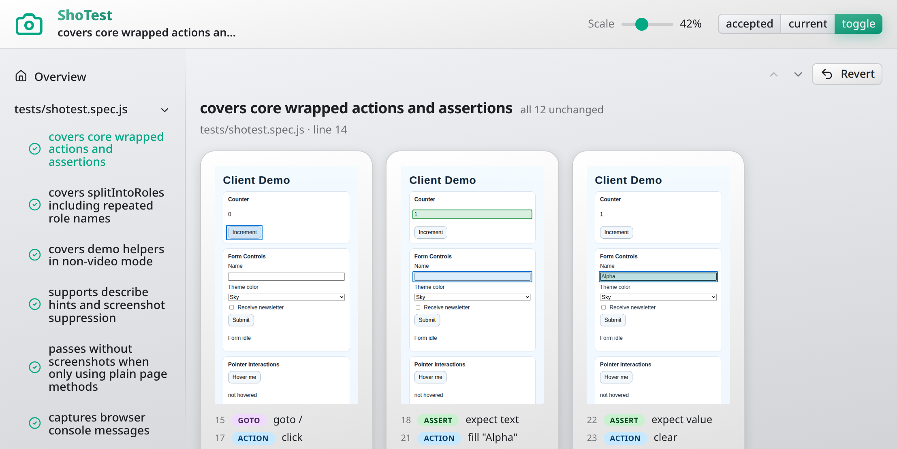

# ShoTest

ShoTest is a small wrapper around Playwright Test that acts as a drop-in replacement and provides:

- Automatic screenshots at every step of your test, with the actions taken and elements verified logged as events alongside each screenshot — shown in the review app as a color-coded list that can point out the exact element on the image.
- A local web app for browsing test results, comparing changes against the stored baseline, and accepting intentional changes.
- HTML snapshots at every step, for debugging (by coding agents).
- Helpers for recording demo videos with visible interactions and natural delays.



## Setup

Install `shotest` (*instead* of installing `@playwright/test` directly) and install a browser:

```bash
npm install -D shotest
npx shotest install chromium
```

Create a `tests/` directory, in which your tests will live as `.spec.ts` files.

Add the `test-results` directory to `.gitignore`.

Create a `playwright.config.ts`, that may look something like this:

```ts
import { defineConfig, devices } from 'shotest';

export default defineConfig({
  use: {
    baseURL: 'https://automationexercise.com/', // set to your app URL
    screenshot: 'off', // ShoTest captures its own screenshots
    viewport: { width: 450, height: 800 },
  },
  timeout: 5000, // ms before a test fails
  workers: 1, // set this if your app has state
  webServer: [ // start your test-servers here (optional)
    // { 
    //   command: 'exec npm run dev -- --port 25833',
    //   port: 25833,
    // },
  ]
});
```

If you use Claude Code, GitHub Copilot or another AI agent that supports Skills, ShoTest includes a `skill/` directory in its npm package that provides the docs such that it can be easily loaded as a skill for in-context guidance while writing tests. To set this up:

```bash
mkdir -p .claude/skills
ln -s ../../node_modules/shotest/skill .claude/skills/shotest
```

## Basic usage

ShoTest re-exports the full Playwright Test API, which you can use like normal. For example:

```ts
// tests/example.spec.ts
import { test } from 'shotest';

test('view and buy a product', async ({ page }) => {
    await page.goto('/');

    await page
        .locator('.product-image-wrapper', { hasText: 'Fancy Green Top' })
        .getByRole('link', { name: 'View Product' })
        .click();

    await page.getByRole('heading', { name: 'Fancy Green Top' }).waitFor();
    await page.getByRole('button', { name: /add to cart/i }).click();
    await page.getByRole('link', { name: /view cart/i }).click();
});
```

Most common page and locator actions are wrapped so that a screenshot is taken automatically during the test.

Run the tests using:

```sh
npx shotest test
```

This writes results to `test-results/`: one `<spec-base>.json` per spec file (listing its tests, steps and metadata), plus the screenshots and HTML snapshots themselves. Screenshots are clean captures — what happened at each moment (clicks, assertions, navigations) is recorded as *events* in the JSON, each with a one-line message, source line and the viewport box of the element involved. Screenshot files are named by a hash of their pixel content, so identical frames — within a test or across tests — share a single file, and names don't change when line numbers shift. Because assertions don't alter the page, a run of checks (usually ended by the action that changes things) collapses into a single screenshot carrying the whole list of events.

The `shotest` command forwards arguments to Playwright, so `npx shotest test --ui` maps to `playwright test --ui`.

When the `--fail-on-visual-changes` flag is passed, ShoTest exits with a non-zero code if any visual changes compared to the accepted baseline in `test-accepted/` (or `$SHOTEST_ACCEPTED_DIR`) are detected, even if the test assertions pass. This allows you to enforce visual consistency in your CI pipeline.

Screenshot comparison is exact: images are named by a hash of their decoded pixels, and two steps match only when their hashes do. There is no tolerance threshold — a one-character text change is a change. What makes that workable is running every test in the same pinned rendering environment, which is the next section.

## Deterministic screenshots

Rendering is a function of the browser build plus the OS font stack. Playwright pins its browser builds to the `@playwright/test` version, and the official Playwright Docker image pins the rest — so ShoTest runs your tests inside the image matching your installed Playwright version by default:

- `npx shotest test` looks for `podman` or `docker` (in that order) and re-runs itself inside `mcr.microsoft.com/playwright:v<version>-noble`, with your project mounted at its real path. Results land in `test-results/` as usual; review them on the host with `npx shotest review`.
- Pass `--no-container` (or set `SHOTEST_NO_CONTAINER=1`) to skip this and run natively. That is the CI pattern: make the Playwright image the job's own image (GitHub Actions: `container: mcr.microsoft.com/playwright:v1.59.1-noble` on the job; GitLab: `image: ...`) and run `npx shotest test --no-container` — no docker-in-docker needed. It is also handy for local functional iteration where pixels don't matter. Without the flag, a machine with no container runner gets a warning and a native run.
- Set `SHOTEST_IMAGE` to override the image, e.g. to pin a digest (`mcr.microsoft.com/playwright@sha256:...`) for byte-for-byte reproducibility — version tags are stable in practice but, like all Docker tags, not contractually immutable.

Keep the image lockstepped with your `@playwright/test` version: a Playwright upgrade means a browser upgrade, which typically means re-accepting baselines once — a deliberate, reviewable event rather than flakiness. Two caveats: baselines are only comparable when everyone (developers and CI) generates them from the same image on the same CPU architecture, and the bind-mounted `node_modules` must be loadable inside the Linux container — true on Linux hosts, but macOS/Windows hosts install their own platform's native modules (e.g. `sharp`), so there prefer running tests in a devcontainer, or let CI produce `test-results/` and review that.

## Step descriptions and skipping screenshots

Attach a one-line hint to what happens next; the review tool shows it as a subtle header above the events that follow it, in the event list below the screenshot (so one screenshot can carry several hints):

```ts
page.describe('Create lunch talk event');
await page.getByRole('button', { name: 'New event' }).click();
```

Routine flows that reoccur in many tests (logging in, seeding data) would otherwise produce countless screenshots. Wrap them in `withoutScreenshots(description, fn)` to skip capture — the review tool shows a subtle placeholder with your description instead, and the wrapped part also runs faster because the stability and capture work is skipped too:

```ts
import { test, withoutScreenshots } from 'shotest';

test('create event', async ({ page }) => {
  await withoutScreenshots('Log in as admin', async () => {
    await page.goto('/login');
    await page.getByLabel('Email').fill('admin@example.com');
    await page.getByRole('button', { name: 'Log in' }).click();
  });
  // ...the part this test is actually about, with screenshots as usual
});
```

A failure inside the block still captures an error screenshot, and explicit `screenshot(page, name)` calls still capture.

## Reviewing and accepting visual changes

In order to review test results, compare changes against the baseline, and accept intentional changes, run the ShoTest review server:

```bash
npx shotest review
```

It serves a web app on localhost and attempts to open it in your default browser.

Steps that share a screenshot are shown as one unit: the image floating on a drop shadow, with the list of recorded events right beneath it, color-coded by type and prefixed with their source line. Browser console output appears in that list too, right between the events it arrived between — quietly for plain logs, in color for warnings and errors. The viewport areas the events involved are outlined on the image; hover the image to see it unobstructed, or hover (or tap) a single event to highlight just that one. When a step changed, the accepted and current versions are cross-faded — each side showing its own event list — and the buttons on the step's status tag pin one side for a closer look. Whether a step counts as changed is decided purely from its screenshots: if the pictures match and the test is green, differing events don't flag anything, though such a step still offers the accepted/current buttons so the two event lists can be compared.

An explicit `screenshot(page, name)` call records a `screenshot` event carrying the name — like any other event, it joins the previous step when the page hasn't visually changed.

When you press the 'Accept visuals' button for a test, its screenshots are copied into the `test-accepted` directory (configurable through `SHOTEST_ACCEPTED_DIR`) and become the new accepted baseline. Like `test-results/`, it holds a flat pool of content-hashed images plus one JSON per spec file; images shared between tests are stored once. It is recommended to commit this directory to version control (unlike `test-results/`).

Because baselines are committed, the pool is recompressed to lossless WebP (about half the size of the PNG, pixel for pixel identical) by a background job — up to 8 images at a time — right after accepting. Content hashes are computed from pixels, not file bytes, so recompression doesn't change any names.

Baselines for tests that produced no results at all are listed separately at the bottom, under *not in test-results/*. Usually their test was renamed or deleted, in which case the baseline is stale and should go — but the same thing happens when a test simply didn't run (e.g. a filtered run), so ShoTest never removes one on its own. Selecting such an entry shows the baseline screenshots it would delete, and 'Delete baseline' removes it.

## Garbage collection

`npx shotest gc` deletes pool images (and HTML snapshots) in `test-results/` and `test-accepted/` that are no longer referenced by any of the JSON files there. It runs automatically after `npx shotest test` when the run was fully green and had no further arguments (extra arguments could mean a filtered run, which sees only part of the picture).

## Multi-user tests

ShoTest can label screenshots per browser page, which makes multi-user interaction tests practical to script and review.

The recommended API is `splitIntoRoles(page, ...)`. It repurposes the current `page` for the first requested role, then creates additional labeled browser sessions for the later roles and opens them on the same URL as the original page.

```ts
import { test, expect, splitIntoRoles } from 'shotest';

test('buyer sees seller status update', async ({ page }) => {
  await page.goto('/orders');

  const { seller, buyer } = await splitIntoRoles(page, 'seller', 'buyer');

  await seller.getByRole('button', { name: 'Mark as shipped' }).click();
  await buyer.getByText('Shipped').waitFor();

  await expect(buyer.getByText('Shipped')).toBeVisible();
});
```

Notes:

- Call `splitIntoRoles(page, ...)` before the first interaction you want attributed to those roles. The first named role reuses the current page.
- Later roles start on the same URL as the original page, but in their own browser sessions.
- Repeating a role name within a test returns the same page instead of creating a duplicate session.
- In the review app, each role's screenshots throw a drop shadow in that role's colour, so the browser windows are easy to tell apart.
- Extra pages created by `splitIntoRoles()` are closed automatically at the end of the test.

## Recording demo videos

ShoTest includes a couple of helper functions (named `demo`Something) that are not part of Playwright, for recording demonstration videos with visible interactions and natural delays. 
 
```ts
import { test, expect, demoTap, demoType, demoPause, demoSwipe } from 'shotest';

test('demo', async ({ page }) => {
  await page.goto('http://localhost:3000');
  await demoTap(page, page.getByRole('button', { name: 'Open settings' }));
  await demoType(page, page.getByLabel('Name'), 'Living room');
  await demoPause(page, 1200);
});
```

**Important:** These helpers behave differently, depending on whether *demo mode* is active:

- Demo mode active. The helper functions will emulate real user interactions with small delays, and add touch effects to taps and swipes. No overlaid screenshots are captured, so as not to disturb the video.
- Demo mode inactive. The helper functions run as fast as possible with no delays or visual effects. This allows you to include your demo recording script in your test suite, without an outsized impact on test runtime.

Demo mode is automatically activated when Playwright video recording is enabled or when it's running in headed mode. You can override this by setting the `SHOTEST_DEMO` environment variable to `on` or `off`.

A convenient way to record demo videos for a run is to set `SHOTEST_VIDEO` to `on` when invoking ShoTest:

```sh
SHOTEST_VIDEO=on npx shotest test
```

This uses Playwright's normal video output handling (which you can also enable through its `defineConfig`), so the videos are written to the standard per-test output directory under `test-results/`. 

### Demo function reference

The following is auto-generated from `src/video.ts`:

### demoTap · function

Tap an element with a visible touch ripple effect.

In video mode, shows an expanding ripple animation at the tap point and
waits briefly after clicking for a natural feel. When not in video mode,
performs an instant click with no delay.

**Signature:** `(page: Page, locator: Locator, delayMs?: number) => Promise<void>`

**Parameters:**

- `page: Page` - - The Playwright page instance.
- `locator: Locator` - - The element to tap.
- `delayMs: number` (optional) - - Post-tap delay in video mode (default: 800ms). Ignored outside video mode.

### demoType · function

Type text character-by-character with natural timing.

In video mode, clicks the element and types each character with a delay,
simulating realistic human typing. When not in video mode, fills the input
instantly using `locator.fill()`.

**Signature:** `(page: Page, locator: Locator, text: string, charDelayMs?: number) => Promise<void>`

**Parameters:**

- `page: Page` - - The Playwright page instance.
- `locator: Locator` - - The input element to type into.
- `text: string` - - The text to type.
- `charDelayMs: number` (optional) - - Delay between characters in video mode (default: 80ms). Ignored outside video mode.

### demoPause · function

Pause for a specified duration (video mode only).

In video mode, waits for the given number of milliseconds, useful for
giving viewers time to see the current state. When not in video mode,
returns immediately with no delay.

**Signature:** `(page: Page, ms?: number) => Promise<void>`

**Parameters:**

- `page: Page` - - The Playwright page instance.
- `ms: number` (optional) - - Duration to pause in milliseconds (default: 2000ms). Ignored outside video mode.

### demoSwipe · function

Perform a swipe gesture with a visible touch indicator.

In video mode, shows a circular touch indicator that follows the swipe
path with eased motion and a fade-out effect at the end. When not in
video mode, performs a fast programmatic swipe with no visual indicator.

**Signature:** `(page: Page, locator: Locator, direction: "up" | "down" | "left" | "right", distancePx?: number) => Promise<void>`

**Parameters:**

- `page: Page` - - The Playwright page instance.
- `locator: Locator` - - The element to swipe on.
- `direction: 'up' | 'down' | 'left' | 'right'` - - Swipe direction: 'up', 'down', 'left', or 'right'.
- `distancePx: number` (optional) - - Distance to swipe in pixels (default: 200).

## Environment variables

For test recording:

- `SHOTEST_CAPTURE_HTML`: Whether to capture DOM HTML alongside screenshots (`'on'` or `'off'`, defaults to `'off'`)
- `SHOTEST_VIDEO`: Enables Playwright video recording for the run. Set it to `on`, `retain-on-failure`, or `on-first-retry`; set it to `off` to disable it.
- `SHOTEST_DEMO`: Whether the video helper methods emulate user behavior (`'on'` or `'off'`, defaults to auto-detecting recording, `SHOTEST_VIDEO`, or headed mode)

For the review server:

- `SHOTEST_OUTPUT_DIR`: Where to read test results (defaults to `test-results`)
- `SHOTEST_ACCEPTED_DIR`: Where to store accepted baseline images (defaults to `test-accepted`)
- `SHOTEST_PORT`: Preferred web server TCP port (defaults to `3847`; if unavailable, ShoTest tries the next 9 ports)

## Migrating from older versions

ShoTest 2.0 changed the on-disk format: screenshots are content-hashed files in a flat pool with one JSON per spec file, instead of line-number-based files in one directory per test. Your tests run unchanged, but old baselines cannot be read (the review tool refuses to start on a 1.x `test-accepted/`): delete `test-accepted/`, rerun your tests, and re-accept the baselines with `npx shotest review`.

Baselines recorded by earlier 2.0 pre-releases — before overlays were replaced by step events — are recognized (their spec JSONs carry no `version` field) and ignored: their tests show up as entirely new in the review app, and accepting them rebuilds the baseline in the current format. Images only such an old baseline referenced are garbage-collected along the way.
